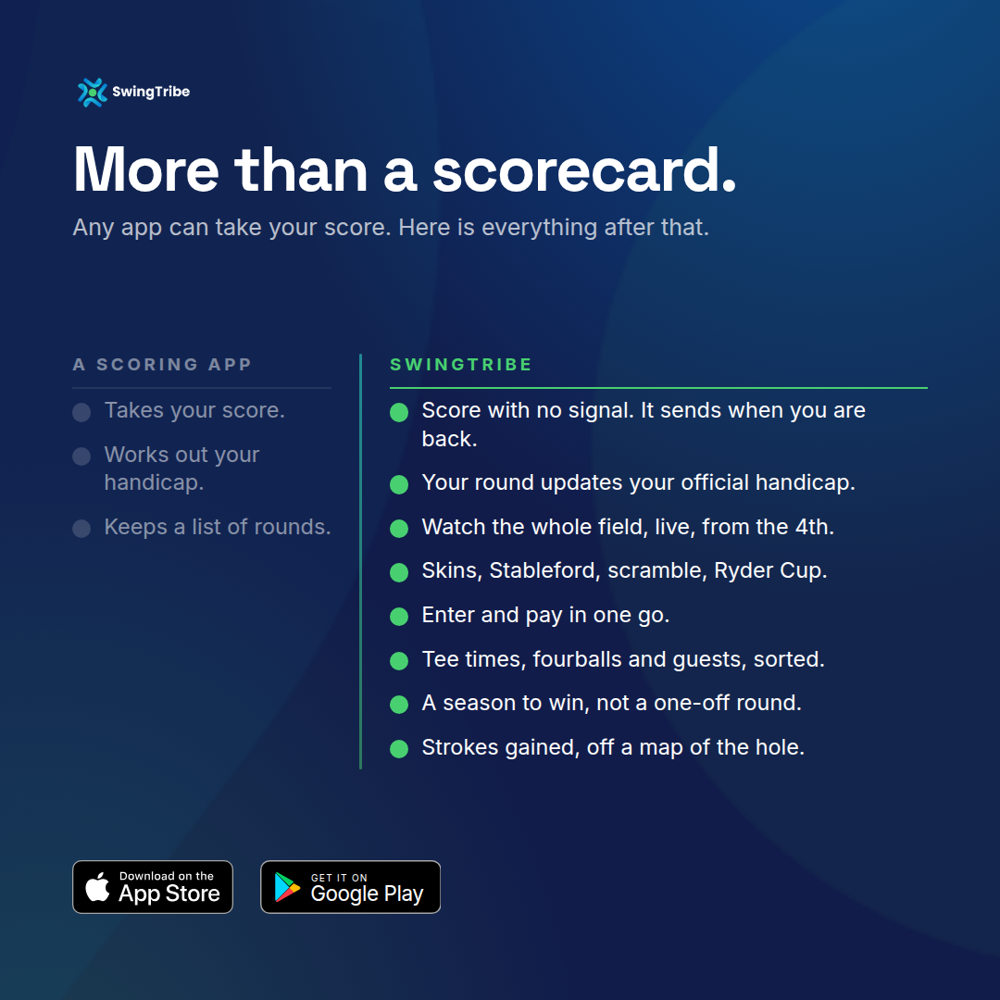

# SwingTribe banners, social adverts and release posts

**[Open the proof sheet](https://nerdgr8.github.io/swingtribe-release-media/)**
to browse all 117 boards at their true shape, filter by surface, and click
through to any file. It is published from this folder by
`.github/workflows/pages.yml` on every push to `main`.

  
  
  

117 boards, generated by `design/banners/build.mjs` in
[`NerdGr8/swingtribe-app`](https://github.com/NerdGr8/swingtribe-app). This
folder is the published copy; that script is the source of truth. Do not edit a
board here by hand, because the next generator run overwrites it.

## What is in here

| Folder | Count | What it is |
| --- | ---: | --- |
| `print/` | 32 | `<slug>-print.pdf`, true size with the fonts embedded. Send these to the printer. |
| `proofing/` | 32 | `<slug>-guides.pdf`, the same board with bleed, safe area and binding drawn on. Internal only, never send to a printer. |
| `social/` | 87 | Exact platform pixel sizes. 70 boards plus 17 `-crop-guide.png` files showing what Instagram crops off a 9:16 post in feed. |
| `whats-new-1.0.8/` | 16 | The release post pack, built from the approved store notes, plus the caption. |
| `index.html` | 1 | The proof sheet. Every board at true shape, with filters and a link to each file. Thumbnails are embedded, so it also works as a downloaded file with no network. |

Print sizes are the 2000 x 1000 mm tee banner, 900 x 1200 and 600 x 900 mm
A-frames, an 850 x 2000 mm pull-up, and the comparison banner.

## Two things to know before touching this folder

**Keep it out of `pr-<n>/`.** `build-index.yml` runs `optimize-and-index.mjs`
on every push under `pr-*/`, and that script converts PNG and WebP to
web-sized JPEG, deletes the original, and prunes folders once 60 newer ones
exist. Social boards are exact-pixel PNGs and print boards are PDFs, so that
would quietly destroy both and then eventually delete the lot. The script only
scans directories matching `^pr-\d+$` and the workflow only triggers on
`pr-*/**`, so `banners/` is outside both. It has to stay a top-level folder.

**The proof sheet and the files have to stay in step.** Each plate links to its
own file by a relative path, which is what makes the page a way in to the
artwork rather than only a picture of it. The Pages workflow re-checks all 117
links against the folder on every deploy and fails rather than publishing a
page full of 404s, so a rebuild that renames a board is caught at deploy time
instead of by whoever clicks first.

**These are binaries in git.** A regenerated set adds another full copy to
history rather than a diff. Push a rebuild when the artwork actually changes,
not on every experiment.

## Hold the What's New pack until the stores serve 1.0.8

It is built from `apps/flutter/store_release_notes.txt`, which is the approved
text, but posting it while the listing still offers the previous build sends
people to the wrong thing.

## The one board that names a competitor

The `*-grint.png` boards read "No maths. No grind. No grint." They are a
deliberate exception: every other board compares against a category
("A SCORING APP"), never a named product. They exist as social artwork only,
have no print version, and `PRINT_FORBIDDEN` in the generator fails the build
if anyone adds one. Note this repository is public, so those files are
world-readable.

## Still outstanding

The official Google Play badge. The generator falls back to the repo's own
vector render, because `play.google.com` is unreachable from the build
environment. Fine to look at, worth replacing before anything paid or printed
at size. Drop the official artwork in as
`design/banners/assets/google-play-badge.png` in the app repo and rebuild.
